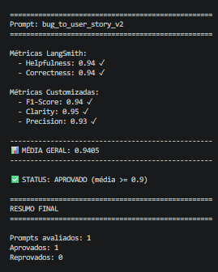

# MBA IA — Pull & Evaluation Prompt

Projeto de otimização e avaliação de prompts com LangSmith. O objetivo é transformar um prompt básico de conversão de bug report em User Story (v1) em um prompt avançado (v2), utilizando técnicas de engenharia de prompt, e validar os resultados com métricas automatizadas.

### Ajuste no script de avaliação

O script [src/evaluate.py](src/evaluate.py) foi alterado em relação à versão original do desafio. O problema era que a função `run_experiment` não iniciava o experimento corretamente no LangSmith — a chamada a `langsmith.evaluate()` não estava registrando as execuções como um Experiment vinculado ao dataset, fazendo com que os resultados não aparecessem no dashboard.

A correção garantiu que o `evaluate()` receba o nome do dataset diretamente (parâmetro `data`), que o `experiment_prefix` seja passado para nomear o experimento, e que os scores sejam coletados iterando sobre os resultados retornados. Sem essa correção, o script executava as inferências mas não publicava as métricas no LangSmith.

---

## Técnicas Aplicadas (Fase 2)

### Visão Geral

O prompt `bug_to_user_story_v2` foi redesenhado do zero com quatro técnicas avançadas de engenharia de prompt. Cada técnica foi escolhida para resolver um problema específico do prompt original (v1), que produzia User Stories genéricas, incompletas e sem padronização de formato.

---

### 1. Skeleton of Thought (SoT)

**O que é:** Uma técnica que instrui o modelo a construir a resposta de forma estruturada antes de preencher os detalhes — como montar um esqueleto antes de adicionar a carne. O modelo primeiro planeja a estrutura, depois preenche cada seção.

**Por que foi escolhida:** O prompt v1 não impunha nenhuma estrutura. O modelo produzia saídas livres, sem seções definidas, às vezes omitindo critérios de aceitação ou contexto técnico. A SoT força uma arquitetura de resposta antes de qualquer geração.

**Como foi aplicada:** A seção `## Processo Interno (não incluir na saída)` define explicitamente os passos de raciocínio que o modelo deve seguir antes de gerar a resposta:

1. Classificar a complexidade do bug (SIMPLES / MÉDIO / COMPLEXO)
2. Extrair todos os sinais técnicos do relato
3. Mapear cada informação para a seção correta da saída
4. Verificar que nenhum dado foi descartado
5. Revisar o formato antes de finalizar

O "esqueleto" da resposta é então determinado pela complexidade identificada no passo 1, com formatos distintos para cada nível.

**Exemplo prático (dataset — bug simples):**

Input:
```
Dashboard mostra contagem errada de usuários ativos. Mostra 50 mas só há 42 na lista.
```

O modelo classifica como **SIMPLES** (passo 1), extrai os números 50 e 42 (passo 2), mapeia para os Critérios de Aceitação (passo 3), e produz exatamente 5 itens no formato Dado/Quando/Então — sem seções extras. Resultado alinhado ao esperado no dataset.

---

### 2. ReAct (Reasoning + Acting)

**O que é:** Uma técnica que combina raciocínio explícito com tomada de ação. O modelo não apenas age (gera texto), mas raciocina sobre o que precisa fazer antes de agir — e usa o resultado desse raciocínio para guiar a ação seguinte.

**Por que foi escolhida:** O prompt v1 mandava o modelo "criar uma user story" sem nenhum raciocínio intermediário. Isso levava a outputs superficiais que ignoravam detalhes técnicos do relato (endpoints, códigos HTTP, thresholds, etc.).

**Como foi aplicada:** O processo interno do prompt é um loop ReAct disfarçado: para cada informação do relato, o modelo raciocina sobre *onde* ela deve ir na saída (Critérios de Aceitação? Contexto Técnico? Critérios Adicionais?) antes de agir e escrevê-la. A instrução *"Verifique que TODA informação do relato está representada na saída"* é o passo de verificação do ciclo Reason → Act → Observe → Reason.

**Exemplo prático (dataset — bug médio, webhook):**

Input:
```
Webhook de pagamento aprovado não está sendo chamado.
Logs do gateway mostram: HTTP 500 ao tentar POST /api/webhooks/payment
```

O modelo raciocina: "HTTP 500 é um detalhe técnico → vai para Contexto Técnico. `/api/webhooks/payment` é o endpoint → vai para o critério Quando. Status 'pendente' é o estado atual → vai para o critério Então." Cada dado do relato é alocado deliberadamente, resultando na saída esperada do dataset com `Contexto Técnico` devidamente preenchido.

---

### 3. Few-Shot Prompting

**O que é:** Fornecer ao modelo exemplos concretos de entrada e saída esperada dentro do próprio prompt, para calibrar o estilo, formato e nível de detalhe da resposta.

**Por que foi escolhida:** O principal problema do v1 era a inconsistência de formato e a ausência de um padrão de referência. O modelo não sabia o que era uma "boa" User Story no contexto deste projeto. Os exemplos resolvem isso de forma direta.

**Como foi aplicada:** O prompt contém **11 exemplos** organizados por nível de complexidade (4 simples, 6 médios, 1 complexo), cobrindo domínios variados: e-commerce, SaaS, mobile, CRM, segurança. Cada exemplo tem exatamente o formato `Entrada: / Saída:` e demonstra uma regra que seria difícil de verbalizar em texto (ex: quando usar "Critérios de Prevenção" vs "Critérios Técnicos").

**Exemplo prático (dataset — bug médio, segurança):**

O Exemplo 7 do prompt mostra como tratar um bug de quebra de controle de acesso com `Critérios Adicionais para Admins` e `Contexto de Segurança`. Quando o modelo recebe o caso do dataset (`Endpoint /api/users/:id retorna dados de qualquer usuário sem validar permissões`), ele reconhece o padrão pelo exemplo e replica a estrutura — incluindo a referência OWASP A01:2021, que não estava explicitamente descrita nas regras.

---

### 4. Self-Consistency

**O que é:** Uma técnica onde o modelo é instruído a verificar sua própria resposta antes de entregá-la, garantindo consistência entre o que foi gerado e as regras definidas.

**Por que foi escolhida:** Mesmo com os exemplos e o processo interno, erros de formato podiam escapar — como usar checkboxes `- [ ]`, adicionar seções proibidas ("Raciocínio", "Observações"), ou esquecer de usar exatamente "Critérios de Aceitação:" como cabeçalho.

**Como foi aplicada:** O passo 5 do processo interno é um checklist de auto-revisão explícito:

- A resposta começa com "Como um/uma..." ou "Como o..."?
- Usa exatamente "Critérios de Aceitação:" como cabeçalho?
- Os critérios usam formato "- Dado que / - Quando / - Então / - E"?
- Não há seções extras desnecessárias?
- A persona é específica ao domínio do bug?

Isso cria um segundo passe interno antes da entrega, reduzindo desvios de formato que escapariam em uma geração única.

**Exemplo prático (dataset — bug complexo, checkout):**

Para o caso com múltiplas falhas críticas (XSS, timeout, race condition, loading infinito), o modelo precisa checar se incluiu seções obrigatórias (`=== USER STORY PRINCIPAL ===`, `=== CRITÉRIOS DE ACEITAÇÃO ===`, etc.) e se não adicionou seções proibidas. A auto-revisão garante que o output final corresponda ao formato esperado no dataset.

---

## Resultados Finais

> Os resultados a seguir foram obtidos avaliando o prompt `bug_to_user_story_v2` contra o dataset de 15 exemplos usando o framework LangSmith com as métricas: Helpfulness, Correctness, F1-Score, Clarity e Precision.

**Dashboard LangSmith:** [Dashboard](https://smith.langchain.com/public/4b2035cb-348f-4fbb-ade6-67b6c3d4db45/d)

**Screenshots das avaliações:**



### Tabela Comparativa: v1 vs v2

| Métrica | v1 (prompt ruim) | v2 (prompt otimizado) | Meta |
|---|---|---|---|
| Helpfulness | 0.86 |  0.95 |  ≥0.90 |
| Correctness | 0.80 |  0.94 |  ≥0.90 |
| F1-Score | 0.72 |  0.94 |  ≥0.90 |
| Clarity | 0.86 |  0.95 |  ≥0.90 |
| Precision | 0.84 |  0.93 |  ≥0.90 |
| **Média Geral** | **0.82** | **0.94** | **≥0.90** |

> Preencha os valores exatos da v2 após executar `python src/evaluate.py`.

**Principais melhorias qualitativas:**

| Aspecto | v1 | v2 |
|---|---|---|
| Definição de persona | Genérica ("assistente") | Específica ("Product Owner sênior") |
| Estrutura da resposta | Livre, sem padrão | Esqueleto definido por complexidade |
| Tratamento de detalhes técnicos | Frequentemente ignorados | Mapeados obrigatoriamente para seções específicas |
| Exemplos de referência | Nenhum | 11 exemplos com 3 níveis de complexidade |
| Verificação de formato | Nenhuma | Checklist de auto-revisão em 5 pontos |
| Cobertura de domínios | Única abordagem | E-commerce, SaaS, mobile, CRM, segurança |

---

## Como Executar

### Pré-requisitos

- Python 3.10 ou superior
- Conta no [LangSmith](https://smith.langchain.com) com API Key
- Chave de API de **um** dos provedores de LLM suportados:
  - [OpenAI](https://platform.openai.com) — modelos `gpt-4o-mini` / `gpt-4o`
  - [Google AI Studio](https://aistudio.google.com) — modelos `gemini-2.5-flash` / `gemini-2.5-pro`

### Dependências principais

- `langsmith` — avaliação e rastreamento de prompts
- `langchain` / `langchain-openai` / `langchain-google-genai` — execução de prompts e integração com LLMs
- `openai` — cliente da API OpenAI
- `google-generativeai` — cliente da API Google Gemini
- `python-dotenv` — carregamento de variáveis de ambiente
- `pytest` — testes automatizados
- `pyyaml` — leitura dos arquivos de prompt

---

### Passo 1 — Configurar variáveis de ambiente

Copie o arquivo de exemplo e preencha com suas credenciais:

```bash
cp .env.example .env
```

Abra o `.env` e preencha os campos obrigatórios. O projeto suporta dois provedores de LLM — escolha um:

**Opção A — OpenAI (configuração padrão):**

```env
# LangSmith
LANGSMITH_TRACING=true
LANGSMITH_ENDPOINT=https://api.smith.langchain.com
LANGSMITH_API_KEY=ls__sua_chave_aqui
LANGSMITH_PROJECT=prompt-optimization-challenge-resolved

# Seu username do LangSmith Hub (visível na URL dos seus prompts)
USERNAME_LANGSMITH_HUB=seu_username

# OpenAI
OPENAI_API_KEY=sk-sua_chave_aqui

# Modelos utilizados
LLM_PROVIDER=openai
LLM_MODEL=gpt-4o-mini      # modelo para geração das respostas
EVAL_MODEL=gpt-4o           # modelo para avaliação das métricas
```

> `gpt-4o-mini` é usado para gerar as User Stories (menor custo), enquanto `gpt-4o` é usado como juiz nas métricas de avaliação (maior qualidade).

**Opção B — Google Gemini:**

```env
# LangSmith (igual ao acima)
LANGSMITH_TRACING=true
LANGSMITH_ENDPOINT=https://api.smith.langchain.com
LANGSMITH_API_KEY=ls__sua_chave_aqui
LANGSMITH_PROJECT=prompt-optimization-challenge-resolved
USERNAME_LANGSMITH_HUB=seu_username

# Google AI Studio
GOOGLE_API_KEY=sua_chave_aqui

# Modelos utilizados
LLM_PROVIDER=google
LLM_MODEL=gemini-2.5-flash  # modelo para geração das respostas
EVAL_MODEL=gemini-2.5-flash  # modelo para avaliação das métricas
```

> Para obter a `GOOGLE_API_KEY`, acesse [Google AI Studio](https://aistudio.google.com/apikey) e gere uma chave gratuita.

---

### Passo 2 — Criar e ativar o ambiente virtual

```bash
# Criar o ambiente virtual
python -m venv .venv

# Ativar no Linux/macOS
source .venv/bin/activate

# Ativar no Windows
.venv\Scripts\activate
```

---

### Passo 3 — Instalar as dependências

```bash
pip install -r requirements.txt
```

---

### Passo 4 — Fazer pull do prompt original (v1)

Baixa o prompt `bug_to_user_story_v1` do LangSmith Hub e salva localmente em `prompts/`:

```bash
python src/pull_prompts.py
```

---

### Passo 5 — Validar o prompt otimizado (v2)

Executa os testes automatizados que verificam se o `bug_to_user_story_v2.yml`:

- Possui `system_prompt` definido
- Define uma persona ("Você é um/uma...")
- Menciona formato Markdown ou User Story padrão
- Contém exemplos Few-Shot (`Entrada:` / `Saída:`)
- Não possui marcadores `[TODO]` pendentes
- Declara pelo menos 2 técnicas nos metadados (`tags`)

```bash
python tests/test_prompts.py
```

Ou via pytest para output detalhado:

```bash
pytest tests/test_prompts.py -v
```

---

### Passo 6 — Publicar o prompt otimizado no LangSmith

Faz o upload do `bug_to_user_story_v2.yml` para o LangSmith Hub, tornando-o disponível para avaliação:

```bash
python src/push_prompts.py
```

> Após o push, o prompt ficará disponível em `https://smith.langchain.com/hub/<seu_username>/bug-to-user-story-v2`.

---

### Passo 7 — Executar a avaliação

Puxa o prompt publicado, executa contra o dataset de 15 exemplos e publica os resultados como Experiment no LangSmith:

```bash
python src/evaluate.py
```

O script executa as 5 métricas (Helpfulness, Correctness, F1-Score, Clarity, Precision) e exibe o resultado no terminal. A média geral deve ser **≥ 0.90** para aprovação.

Ao final, o link para o dashboard com os resultados será exibido no terminal.
